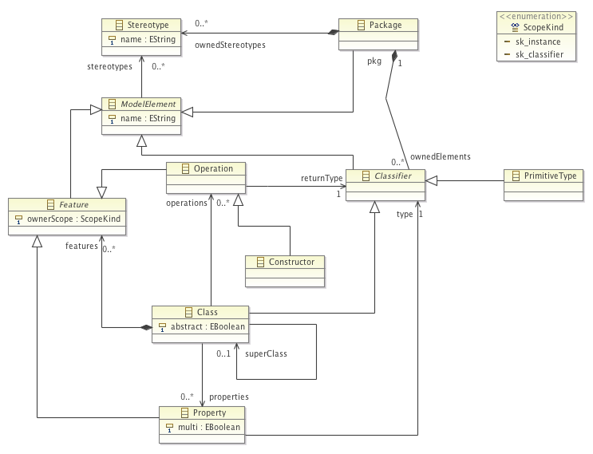

This pages contains additional material accompanying the paper _"SIGMA: Scala Internal Domain-Specific Languages for Model Manipulations"_ for [MODELS'14](http://www.modelsconference.org/) conference.

## Models

### Simple Object-Oriented Model (OO Model)

## Evaluation - Code Comparison

Following are the resource used for the code comparison between Epsilon and SIGMA.
All SIGMA related code is in the [MODELS14](https://github.com/fikovnik/Sigma/tree/feature/MODELS14) branch.
The following projects were suggested by the [Epsilon community](http://www.eclipse.org/forums/index.php?t=rview&goto=1235103) as a good fit for larger model manipulations that are publicly accessible.

#### Model Consistency Checking
*  [Eugenia](http://www.eclipse.org/epsilon/doc/eugenia/) GMF Ecore constraints for model consistency checking 
    * [Epsilon version](https://dev.eclipse.org/svnroot/modeling/org.eclipse.epsilon/trunk/plugins/org.eclipse.epsilon.eugenia/transformations/ECore2GMF.evl)
    * [SIGMA version](https://github.com/fikovnik/Sigma/blob/feature/MODELS14/examples/fr.unice.i3s.sigma.examples.models14/src/fr/unice/i3s/sigma/examples/models14/validation/ECore2GML.scala))
    * If we only count the code difference between EVL and SIGMA the result is the same 22% reduction (364 EVL lines vs 287 SIGMA lines). However, Epsilon version is using a lot of code that is in a shared module [ECoreUtil.eol](https://dev.eclipse.org/svnroot/modeling/org.eclipse.epsilon/trunk/plugins/org.eclipse.epsilon.eugenia/transformations/ECoreUtil.eol)
    * We used Epsilon SVN revision r2479

#### Model-to-Model Transformation

* [Unicaneer2sql](https://code.google.com/p/unicaneer2sql/) (an ER to relational model transformation) for M2M transformation
    * [Epsilon version](https://code.google.com/p/unicaneer2sql/source/browse/trunk/Software/es.unican.moses.transformations.db.eer2relational/Transformations/eer2relational.etl)
    * [SIGMA version](https://github.com/fikovnik/Sigma/blob/feature/MODELS14/examples/fr.unice.i3s.sigma.examples.models14/src/fr/unice/i3s/sigma/examples/models14/m2m/EER2Relational.scala)
    * We used Unicaneer2sql SVN revision r227

#### Model-to-Text Transformation

* [Egldoc](https://wiki.eclipse.org/EDT:EGLDoc) (an Epsilon tool for generating Ecore documentation in HTML including Graphviz diagram) for M2T transformation 
    * [Epsilon version](https://dev.eclipse.org/svnroot/modeling/org.eclipse.epsilon/trunk/examples/org.eclipse.epsilon.examples.egldoc/)
    * [SIGMA version](https://github.com/fikovnik/Sigma/tree/feature/MODELS14/examples/fr.unice.i3s.sigma.examples.sigmadoc)
    * The complete code is ported including Eclipse launch configurations
    * We used Epsilon SVN revision r2479

## Evaluation - Performance Comparison

Code related to M2T performance comparison is available in the [performance example](https://github.com/fikovnik/Sigma/tree/feature/MODELS14/examples/fr.unice.i3s.sigma.examples.performance).