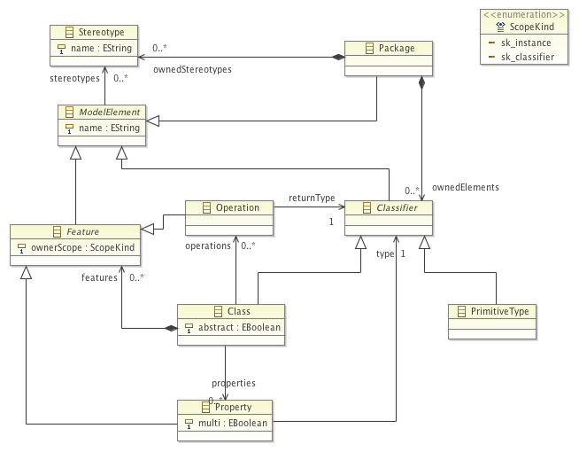

This pages contains additional material accompanying the paper _"Exploring Internal Domain-Specific Languages for Model Manipulation"_ for [PL'14](http://www.cse.unt.edu/~bryant/sac2014/) conference. All Sigma related code is in the [PL14](https://github.com/fikovnik/Sigma/tree/feature/PL14) branch. The code listed in the paper is available in the [fr.unice.i3s.sigma.examples.pl14](https://github.com/fikovnik/Sigma/tree/feature/PL14/examples/fr.unice.i3s.sigma.examples.sle13) project.

## Models

### Object-Oriented Model (OO Model)

### Relational Model (DB Model)

## M2T Micro-Benchmarking

The example on which we run a sample micro benchmarks was inspired by the example from [Acceleo tutorial](http://wiki.eclipse.org/Acceleo/Getting_Started#Generating_java_beans).

### Code

- Sigma: [OO2Java.scala](https://github.com/fikovnik/Sigma/blob/feature/PL14/examples/fr.unice.i3s.sigma.examples.sle13/src/fr/unice/i3s/sigma/examples/sle13/sigma/OO2Java.scala)
- Scala: [OO2JavaInScala.scala](https://github.com/fikovnik/Sigma/blob/feature/PL14/examples/fr.unice.i3s.sigma.examples.sle13/src/fr/unice/i3s/sigma/examples/sle13/scala/OO2JavaInScala.scala)

    The idea behind a _pure_ Scala implementation (no implicit conversions) is to get an impression about the performance degradation of using Sigma in comparison to only Scala. 
- Java: [OO2JavaInJava.java](https://github.com/fikovnik/Sigma/blob/feature/PL14/examples/fr.unice.i3s.sigma.examples.sle13/src/fr/unice/i3s/sigma/examples/sle13/java/OO2JavaInJava.java)
- Acceleo: [OO2Java.mtl](https://github.com/fikovnik/Sigma/blob/feature/PL14/examples/fr.unice.i3s.sigma.examples.sle13.acceleo/src/fr/unice/i3s/sigma/examples/sle13/acceleo/main/OO2Java.mtl)
- Epsilon EGL: [OO2Java.egl](https://github.com/fikovnik/Sigma/blob/feature/PL14/examples/fr.unice.i3s.sigma.examples.sle13.epsilon/src/fr/unice/i3s/sigma/examples/sle13/epsilon/OO2Java.egl), [JavaClass.egl](https://github.com/fikovnik/Sigma/blob/feature/PL14/examples/fr.unice.i3s.sigma.examples.sle13.epsilon/src/fr/unice/i3s/sigma/examples/sle13/epsilon/JavaClass.egl)

    The EGL code was split to simulate similar modularity of the other M2T transformations. The run was made only using the `JavaClass.egl`

- Kermeta: [kermeta-m2t.tar.bz2](files/PL14/kermeta-m2t.tar.bz2)

    The Kermeta version of the M2T transformation has been provided by Didier Vojtisek from the Kermeta team. The linked archive contains a full Kermeta 2 project.
