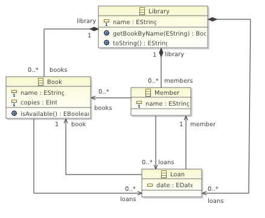
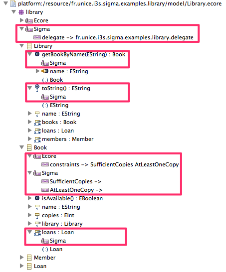

_Following documentation is outdated. Sigma now support instance delegates that are far easier to use. The documentation is coming soon._

The core part of the Sigma framework is in the ability to enrich EMF models by delegating the computation of derived features, operation bodies and validation of structural constraints. While EMF supports extending the generated model code using Java, it actually breaks the [Generation Gap Pattern](http://www.research.ibm.com/designpatterns/pubs/gg.html). Instead, the Sigma framework allows to delegate the computation to some external methods that can be written in any [JVM based language TODO]() and the model contains only a reference where to find such methods. 

* For a 5 minutes introduction have a look at [Enriching EMF Models with Scala](http://www.slideshare.net/krikava/enriching-emf-models-with-scala) - a quick overview of Sigma Core given at [EclipseCon'12 Europe Modeling Symposium](http://eclipsesource.com/blogs/2012/10/22/modeling-symposium-eclipsecon-europe-2012/)

* For a 15 minutes introduction have a look at [On the Use of an Internal DSL for Enriching EMF Models](http://www.slideshare.net/krikava/krikava-ocl12) - a presentation given at [OCL'12 workshop](http://st.inf.tu-dresden.de/OCL2012/)

* For a deeper understanding and the motivation have a look at [On the Use of an Internal DSL for Enriching EMF Models](http://st.inf.tu-dresden.de/OCL2012/preproceedings/09.pdf) paper from [OCL'12 workshop](http://st.inf.tu-dresden.de/OCL2012/)

In sigma there are three delegates:

1. _Invocation Delegates_ - delegating computation of operations
2. _Setting Delegates_ - delegating computation of derived features (attributes and references)
3. _Validation Delegates_ - delegating computation of invariant checks

These delegates are supported by EMF in two ways:

1. _Dynamic delagation_
2. _Static delegation_

In the following section we will overview these concepts on a concrete example.

### Running Example ###

For the following content, lets consider the classical model of a library that contains books and members that can rent out some these books:

This example can be easilly installed by going to the `File -> New -> Example … -> Example` menu and selecting the `Sigma Examples -> Library Example` example. It demonstrates the basics of the Sigma delegation. It is accompanied with a junit test cases that besides verifying that the provided functionality works also demonstrates how to use Sigma standalone and how to use the quick fixes.

### Sigma Delegates ###

The Sigma delegates are external methods that are called when a corresponding functionality is called at the model instances. These methods must be visible from the model classes and defined as static (object methods in Scala). 
Each Sigma method delegate is executed in the context of an instance of a specific model class. The actual contextual instance reference is passed to the delegate method always in the first parameter, usually named `self` (Similarly to [OCL TODO]()). For example, any delegate method operating in the `Book` context will have following signature:
    
* In Java

      public static ??? methodDelegateName(Book self [, …]);
    
* In Scala

      def methdoDelegateName(self: Book [, …]): ???
    
where the `self` refers to an instance of `Book`.

#### Invocation Delegates ####

The `Library` class defines two operations:

* `getBookByName` that maps a string representing a name of a book to an instance of a `Book` shall there be one,
* `toString` that returns a description of the library instance.

The delegating model of Sigma therefore expects two delegete methods with following signatures:

* In Java

      public static Book invokeGetBookByName(Library self, String name);
      public static String invokeToString(Library self);

* In Scala

      def invokeGetBookByName(self: Library, name: String): String
      def invokeToString(self: Library): String

In general, given a class $T$ with an operation $op$, arguments $arg_1, \dots, arg_n$ of types $T_1, \dots, T_n$ with a return type $R$, the delegate mechanism will look for a following method signature:

* In Java

  $$\text{public static}\ R\ \text{invoke} Op \left(T\ self,\ T_1\ arg_1,\ \dots,\ T_n \ arg_n \right)$$
  
* In Scala
  
  $$\text{def}\ \text{invoke} Op \left(self:\ T,\ arg_1:\ T_1,\ \dots,\ arg:\ T_n \right):\ R$$

_Note that the prefix `invoke` is a default naming convention convention imposed, but it can be overriden._

#### Setting Delegates ####

The method signatue for the derived features is similar, but there are is _always_ only one method parameter i.e. `self`.

The Book class defines a derived reference `loans`. The delegating model of Sigma therefore expects a delege method with following signatures:

* In Java

      public static EList<Loan> getLoans(Book self);

* In Scala

      def getLoans(self: Book): List[Loan]

In general, given a class $T$ with a feature $ftr$ of types $R$, the delegate mechanism will look for a following method signature:

* In Java

  $$\text{public static}\ R\ \text{get} Ftr \left(T\ self \right)$$
  
* In Scala
  
  $$\text{def}\ \text{get} Ftr \left(self:\ T \right):\ R$$

_Note that the prefix `get` is a default naming convention convention imposed, but it can be overriden._

#### Validation Delegates ####

The `Book` class defines a constraint `SufficientCopies` checking that there are enough books for all the loans.

The delegating model of Sigma therefore expects a delege method with following signatures:

* In Java

      public static boolean validateSufficientCopies(Book self);

* In Scala

      def validateSufficientCopies(self: Book): Boolean

In general, given a class $T$ with an invariant $inv$, the delegate mechanism will look for a following method signature:

* In Java

  $$\text{public static}\ R\ \text{validate} Inv \left(T\ self \right)$$
  
* In Scala
  
  $$\text{def}\ \text{validate} Inv \left(self:\ T \right):\ R$$

Where $R$ can be either:

* A `boolean` (or `Boolean` in Scala).
* A `String` (or `Option[String]` in Scala); allowing to specify a detail message why the invariant does not hold on the given instance or `null` (`None` in Scala) shall the invariant hold.
* A `fr.unice.i3s.sigma.ValidationResult` (or `fr.unice.i3s.sigma.scala.ValidationResult` in Scala); allowing to specify more details including error code and quick fixes. (_TODO: add docs links_)

_Note that the prefix `validate` is a default naming convention convention imposed, but it can be overriden._

### Integrating Sigma Delegates into EMF ###

Normally, for each derived feature and operation body, the EMF code generates creates a method in the corresponsing Java class that looks like this:

	/**
	 * <!-- begin-user-doc -->
	 * <!-- end-user-doc -->
	 * @generated
	 */
	@SuppressWarnings("unchecked")
	public EList<Loan> getLoans() {
		// TODO: implement this method to return the 'Loans' reference list
		// Ensure that you remove @generated or mark it @generated NOT
		// The list is expected to implement org.eclipse.emf.ecore.util.InternalEList and org.eclipse.emf.ecore.EStructuralFeature.Setting
		// so it's likely that an appropriate subclass of org.eclipse.emf.ecore.util.EcoreEList should be used.
		throw new UnsupportedOperationException();
	}

Our goal is to change this behavior so instead the EMF code generator generates a call to the appropriate Sigma delegate method. In order to do this we need to:

1. tell Sigma where these methods are, and
2. make EMF aware of the Sigma framework by using either dynamic delagates, or static delegates.

The actual location of the delegate methods is encoded in annotations. In Sigma, each package, class, feature, operation and constraint can carry an annotation that specifyies where the approprite delegate method is located.
The source of the this annotation is `http://www.i3s.unice.fr/Sigma` (for Java) or `http://www.i3s.unice.fr/Sigma/Scala` (for Scala). Other languages may follow later.

For example, the `Library.getBookByName()` method expressed in the XMI looks like:

    <eClassifiers xsi:type="ecore:EClass" name="Library">
      <eOperations name="getBookByName" eType="#//Book">
        <eAnnotations source="http://www.i3s.unice.fr/Sigma"/>
        <eParameters name="name" eType="ecore:EDataType http://www.eclipse.org/emf/2002/Ecore#//EString"/>
      </eOperations>
      …
    </eClassifiers>  

The important part is the `<eAnnotations source="http://www.i3s.unice.fr/Sigma"/>`. This indicates that this operation will be handled by a Sigma delegate. However, as it is, it does not specify exactly where is the target delegate method (the `invokeGetBookByName`). The actual location is specified in an annotation detail named `delegate`:

    <eAnnotations source="http://www.i3s.unice.fr/Sigma">
      

    </eAnnotations>

Normally, the delegate methods are somehow logically groupped and thus it would be tedious to specify the location for every feature while it can be easily derived from its name. Therefore, in Sigma, the annotation can be placed also on a package or a class element specifying location of delegate package or delegate class respectively. The location resolver then works bottom up, trying to get the `delegate` annotation detail from

1. A feature element (structural feature, operation, invariant). At this level the `delegate` location must be a fully qualified class name together with a name of the method. This is the place where the default prefixes can be overriden.
2. The containing class. The `delegate` at this level conrains only the name of the class. The actual method name will be derived from its name and one of the default prefixes (`invoke`, `get`, `validate`).
3. The containing package. At this level the `delegate` specifies only the package name. The actual class name will be derived from the containing class name with `Delegate` suffix. The method name will be computed in the same way as is done in the previous step.
4. the containing package super packages until it reaches the beginning of the hierrarchy. At this level, it is the same as at the previous obe with the difference, that the sub packages will be added to the name.

Following the delegate settings in the figure above, Sigma will look for delegates in:

* `Library.getBookByName` operation in `fr.unice.i3s.sigma.examples.library.delegate.LibraryDelegate.invokeGetBookByName`
* `Library.toString` operation in `fr.unice.i3s.sigma.examples.library.delegate.LibraryDelegate.toString`
* `Book.SufficientCopies` constraint in `fr.unice.i3s.sigma.examples.library.delegate.BookDelegate.validateSufficientCopies`
* `Book.AtLeastOneCopy` constraint in `fr.unice.i3s.sigma.examples.library.delegate.BookDelegate.validateAtLeastOneCopy`
* `Book.loans` getter in `fr.unice.i3s.sigma.examples.library.delegate.BookDelegate.getLoans`

#### Model Constraints ####

The structural constrains in EMF are represented as operations that follows certain signature. The name of the operation is the name of the constraint and the first two arguments are:

1. `diagnostics: DiagnosticChain`
2. `context: Map<Object, Object>`

The constraint names have to be also presented in the `Ecore` annotation (`http://www.eclipse.org/emf/2002/Ecore`), in the `constraints` detail separated by space.

For example, the `SufficientCopies` invariant will have following method generated in the `BookImpl` class:

    public boolean SufficientCopies(DiagnosticChain diagnostics, Map context) {
        // TODO: implement this method
        // -> specify the condition that violates the invariant
        // -> verify the details of the diagnostic, including severity
        // Ensure that you remove @generated or mark it @generated NOT
        if (false)
        {
          if (diagnostics != null)
          {
            diagnostics.add(
              new BasicDiagnostic(
                Diagnostic.ERROR,
                LibraryValidator.DIAGNOSTIC_SOURCE,
                LibraryValidator.BOOK__SUFFICIENT_COPIES,
                EcorePlugin.INSTANCE.getString(
                  "_UI_GenericInvariant_diagnostic",
                  new Object[] {
                    "SufficientCopies",
                     EObjectValidator.getObjectLabel(this, context)}),
                new Object [] { this }));
        }
        return false;
      }
      return true;
    }

The Sigma framework only requires to have the `Ecore` annotation present and to have a Sigma annotation detail for each invariant defined. The key of the detail is the anotation name and the value is either empty or it is a fully qualified class name with a method name that specifies the delegate method for the invariant. It sort of simulates the `delegate` detail from the other features, however it is required in this case.

#### Dynamic Delegates ####

The dynamic delegation is a feature of EMF that allows to have the EMF model enriched in other languages than Java. What it does is to encode the actual code inside an annotation that is attached at a model feature and then register a delegate that knows how to interpret this code and that will be called at runtime. For example OCL expressions can be used in this setup. Sigma regular methods and thus it only uses the annotation details to encode information where these methos are.

Following steps are required to use the dynamic delegates:

1. Add delegate information to the Ecode model
2. Register the Sigma delegates (only necessary for the standalone run i.e. junit tests)

To better understand the EMF dynamic delegation, plese refere to [EMF documentation](http://wiki.eclipse.org/EMF/New_and_Noteworthy/Helios).

_TODO: to be written_

#### Static Delegates ####

The static delegates are created by the EMF code generation process and they simply represent a direct method invocation of the delegate method from within the actual EClass operation method body.

The static delegates are propertly supported only in EMF 2.8+. This version contains the crucial [commit](https://git.eclipse.org/c/emf/org.eclipse.emf.git/commit/?id=c0aaf6a9f603271bc7d7a00e1ba6da7fdbb4f1bc) that allows to specify a body for derived property getter. This commit is included in the Eclipse Modeling Framework SDK version 2.8.1 that can be installed using the update manager from the following URL: `http://download.eclipse.org/modeling/emf/emf/updates/releases/` in Indigo. In Juno it is already available in the default repository.

_TODO: to be written_

* There is no extra setup required. If the codegen finds that no Ecore dynamic delegates are present in the Ecore model, it will generate the static delegates.
* By default, the example is using the dynamic delegation, but it can be easily changed for the static one simply by removing the `Ecore` annotation from the `library` package.
* Under the hood all constraints are converted to the invariant methods.