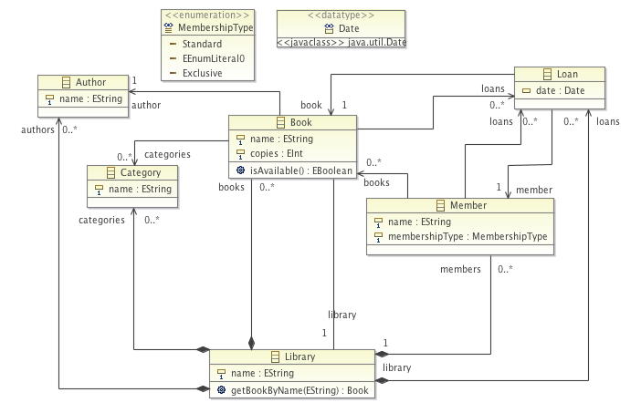

## Basics ##

This page describes the navigation and modification support. The examples use the sample library model. All related code is available in the [`fr.unice.i3s.sigma.examples.library`](https://github.com/fikovnik/Sigma/tree/develop/fr.unice.i3s.sigma.examples.library) project.

_TBW_

### Library Model ###

This is a slightly modified version of the library example from [Eclipse OCL tutorial](http://help.eclipse.org/indigo/index.jsp?topic=%2Forg.eclipse.ocl.doc%2Fhelp%2FTutorials.html).

### EMF Scala Support Generator ###

_TBW_

## Navigation Support ##

_TBW_

## Modification Support ##

_TBW_

### Delayed Initialization ###

In some cases it is convenient to postpone initialization of an `eObject`. Sigma support delayed initialization that will be execute when the `eObject` is contained. For example:

    // creates a new book
    val sicp = Book(name = "SICP") initLater { e ⇒
      // the code within this block will be executed once
      // sicp has been contained
      e.copies = 10
    }

    // the initLater has not been yet executed
    sicp.copies must be(0)

    //adds to library and executes initLater
    library.books += sicp

    sicp.copies must be(10)

The support is realized using EMF adaptors, concretely the `PostponeContentInitializerAdapter`. This adapter is added to every `eObject` instance that is created using the `EMFBuilder`.

### Lazy Proxy Resolution ###

Sigma support automatic creation and lazy resolution of EMF proxies. This is handy when referencing non-contained objects. For example, in the following code we create an instance of a `Book` and assign it author to a reference, that will be resolved later.

    val sicp = library.books +== Book(name = "SICP")

    // the author setter is overloaded
    // this expression is using the Option[Author] version
    // it will create EMF proxy
    sicp.author = library.authors find(_.name == "H. Abelson")
    sicp.author.eIsProxy must be(true)

    // when we add author the proxy will be resolved
    library.authors +== Author(name = "H. Abelson")

    // author proxy gets resolved
    sicp.author.name must be ("H. Abelson")
    sicp.author.eIsProxy must be(false)

The `find` method returns an `Option[Author]`, which is an incompatible type with the author setter parameter. However, Sigma EMF support generator creates an extra setter for each non-contained reference that accepts an `Option[A]` where `A` is the type of the reference object.

    // original setter
    def author_=(value: Author): Unit = that.setAuthor(value)
    // extra setter creating EMF proxy
    def author_=(value: ⇒ Option[Author]): Unit = 
      that.setAuthor(LibraryPackageScalaSupport._libraryBuilder.ref(value))

The same technique can be used for non-contained reference list. For example:

    val sicp = library.books +== Book(name = "SICP")

    // categories are empty
    sicp.categories must have size (0)

    // add a category using the overloaded operator +=(value: Option[A])
    sicp.categories += library.categories find (_.name == "Programming")

    // a proxy has been created
    sicp.categories must have size (1)
    sicp.categories(0).eIsProxy must be(true)

    // when we add category the proxy will be resolved
    library.categories += Category("Programming")
    
    sicp.categories(0).name must be ("Programming")

In this case the support is realized using an overloaded operator `+=` defined on `EList` in `EMFScalaSupport`:

    def +=(elem: => Option[A])(implicit proxyBuilder: EMFProxyBuilder[A]) {
      that.add(proxyBuilder(elem))
    }

For it to be usable, it requires an implicit parameter of type `EMFProxyBuilder`. That is an object that know how to create an EMF proxy of type `A` from an expression that resolves to `Option[A]`. For each `EClass`, the EMF Scala support generator generates one such a builder. For example in the class `AuthorScalaSupport` there is

    protected implicit val _authorProxyBuilder = 
      new EMFProxyBuilder[Author](LibraryPackageScalaSupport._libraryBuilder)

